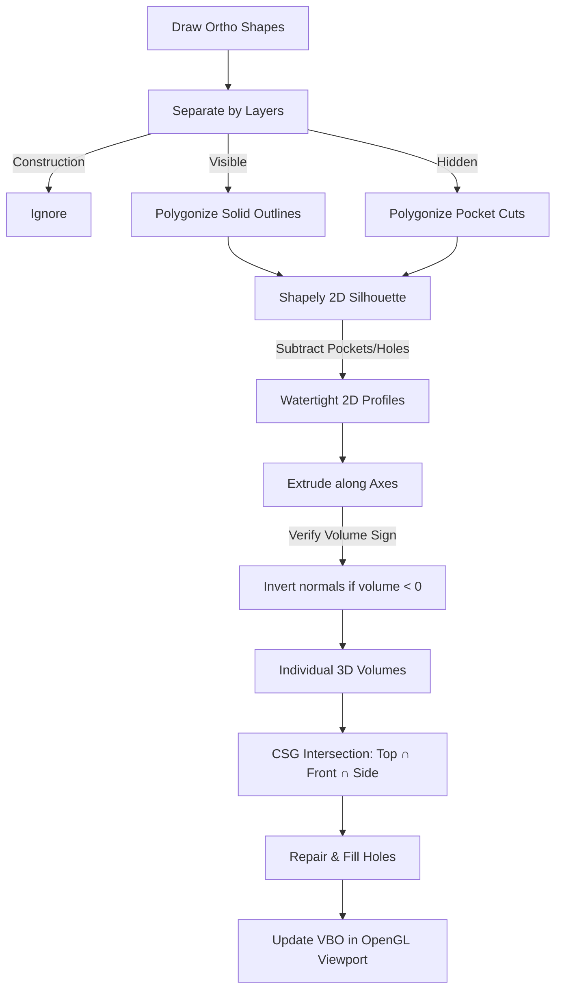

# Project Plan, Aim & Status: Python CAD Pro

This document outlines the core objectives, architectural details, geometric mapping constraints, completed implementation stages, and testing results for **Python CAD Pro**—a professional, desktop CAD application featuring an intelligent 2D-to-3D orthographic reconstruction pipeline.

---

## 🎯 1. Project Aim & Vision

The primary goal of **Python CAD Pro** is to bridge the gap between 2D drafting and 3D modeling. It enables users to draw standard Top, Front, and Side orthographic projections, and automatically reconstructs a watertight, manifold 3D solid mesh using Constructive Solid Geometry (CSG) Boolean intersections and subtractive feature recognition.

### Core Objectives
1. **Interactive 2D CAD Editor**: A high-performance, vector-based PyQt6 drafting interface supporting grid/object snapping, visual alignment guidelines, and precise drawing tools (lines, rectangles, circles, polygons).
2. **Engineering Graphics Standards**: Process multiple lines including **Visible** lines (boundary solids), **Hidden** lines (subtractive holes/pockets), and **Construction** lines (drafting helper guidelines ignored in 3D).
3. **Parametric AutoCAD-style Command Console**: A bottom command bar supporting absolute coordinate positioning (`#x,y`), relative coordinate offsets (`dx,dy`), and strict line segment length locks.
4. **Modern, Thread-Safe 3D Viewer**: A native `QOpenGLWidget` displaying the watertight solid in real-time using Vertex Buffer Objects (VBOs) for hardware acceleration.
5. **Robust CSG Pipeline**: Volumetric intersections of extruded orthographic profiles using `trimesh` and the high-performance C++ `manifold3d` backend.
6. **CAD Exports**: Generate industrial standard models suitable for manufacturing and 3D printing (`.stl`, `.obj`).

---

## 🏗️ 2. Project Stage & Status (100% Completed)

The project is fully implemented, verified, and running. The architecture follows a strict MVC (Model-View-Controller) pattern with thread-safe separation between UI rendering and heavy geometric operations.

### Directory Structure
```
python-cad-pro/
├── src/
│   ├── engine/             # MODEL Layer
│   │   └── cad_engine.py   # Stores shape models, layers, and transaction history
│   ├── ui/                 # VIEW/CONTROLLER Layer
│   │   ├── canvas.py       # 2D QGraphicsView canvas with snap/ortho/projection guides
│   │   ├── toolbar.py      # Left vertical toolbar with tool/layer selectors
│   │   ├── viewport_3d.py  # Modern VBO-based OpenGL widget with arcball camera
│   │   └── main_window.py  # Central GUI window and console parser
│   └── reconstruction/     # BUSINESS LOGIC (CSG Pipeline)
│       └── reconstructor.py# Background QThread for 2D profile and 3D extrusion/CSG
├── tests/                  # VERIFICATION Layer
│   └── test_reconstruction.py # Pytest suite for box, cylinder, and hollow pipe volumes
├── requirements.txt        # Dependency definitions
├── run.bat                 # Windows execution helper
└── PROJECT_PLAN.md         # This technical specification
```

### Completed Subsystems

| Subsystem | Components | Completed Capabilities | Implementation Details |
| :--- | :--- | :--- | :--- |
| **GUI & UI Shell** | `main_window`, `toolbar` | • Left vertical toolbar with layer selector.<br>• Tabbed 2D views (Top, Front, Side).<br>• Real-time OpenGL 3D viewer pane. | PyQt6 layouts with custom modern dark-theme stylesheet. |
| **2D Vector Drafting** | `canvas` | • Infinite pan (middle drag) & zoom (wheel).<br>• Custom Snapping: Grid (10px) + OSNAP (Endpoints, Midpoints, Centers, Vertices).<br>• Ortho constraint mode (`Shift` key).<br>• Cross-canvas dashed guidelines. | Subclassed `QGraphicsView` & `QGraphicsScene` for high-performance vector rendering. |
| **CAD Data Engine** | `cad_engine` | • Strict serialization-based history stack.<br>• **100-step Undo/Redo** with active description outputs (e.g. *Undo: Draw Circle*). | Mutability bugs avoided by duplicating JSON snapshots of shape lists. |
| **CSG Reconstruction** | `reconstructor` | • Background `QThread` pipeline execution.<br>• Shapely silhouette contour grouping (`polygonize`).<br>• Nested containment hole subtraction.<br>• Volumetric Boolean intersections.<br>• `MultiPolygon` extrusion & concatenation. | Extrudes profiles along respective axes using C++ `manifold3d` through `trimesh`. |
| **3D Rendering** | `viewport_3d` | • Arcball camera (rotate, pan, zoom).<br>• Dual directional lights + ambient lighting.<br>• Reference floor grid. | Modern OpenGL using Vertex Buffer Objects (VBOs) for points, normals, and indices. |
| **Exports & Tests** | `main_window`, `test_reconstruction` | • Wavefront `.obj` and stereolithography `.stl` file exports.<br>• Volumes mathematically validated in tests. | Verification asserts volume accuracy within 1-1.5% tolerances. |

---

## 📐 3. Coordinate Alignment & Projection Math

In orthographic drawing, the coordinates of the 2D canvases must map correctly onto a unified 3D coordinate system.

Let the 2D canvas coordinates be $(u, v)$ where $u$ increases to the right and $v$ increases downwards. To map these to 3D space $(X, Y, Z)$ (where $+Y$ is Up, $+X$ is Right, and $+Z$ is towards the viewer), we apply specific translation and axis mapping equations. We compute the global 3D extrusion bounds from the active drafting limits of each view:

```
           +Y (Up)
            |
            |
            |_______ +X (Right)
           /
          /
        +Z (Towards Viewer)
```

### Projection Transformations

#### 1. Top View (Looking Down from +Y onto XZ Plane)
*   **Horizontal Axis ($u$)** maps to **3D $X$**
*   **Vertical Axis ($v$)** is inverted (multiplying by $-1$ to represent positive coordinates extending upward in CAD space) and maps to **3D $Z$**
$$\begin{cases} X_{3D} = u \\ Y_{3D} = Y_{\text{extrusion}} \\ Z_{3D} = -v \end{cases}$$
*   *Note*: Mapping $(u, v) \rightarrow (X, Z, Y)$ swaps two columns, introducing a 3D reflection. This mirrors the winding order of the faces (from CCW to CW) and turns the normals inside-out (creating a negative volume). We mathematically correct this in `_prepare_mesh()` by inverting the faces and recalculating normals if `mesh.volume < 0`.

#### 2. Front View (Looking from +Z onto XY Plane)
*   **Horizontal Axis ($u$)** maps to **3D $X$**
*   **Vertical Axis ($v$)** is inverted and maps to **3D $Y$**
$$\begin{cases} X_{3D} = u \\ Y_{3D} = -v \\ Z_{3D} = Z_{\text{extrusion}} \end{cases}$$

#### 3. Side View (Looking from +X onto ZY Plane)
*   **Horizontal Axis ($u$)** maps to **3D $Z$**
*   **Vertical Axis ($v$)** is inverted and maps to **3D $Y$**
$$\begin{cases} X_{3D} = X_{\text{extrusion}} \\ Y_{3D} = -v \\ Z_{3D} = u \end{cases}$$
*   *Note*: Swapping horizontal and vertical components $(u, v) \rightarrow (Z, Y, X)$ swaps two columns, introducing a reflection. This is corrected in `_prepare_mesh()`.

---

## 🛠️ 4. CSG Reconstruction Pipeline



### 1. Shape Separation & Ignored Elements
*   **Visible Layer** (`Visible` layer): Converted to boundary polygons.
*   **Hidden Layer** (`Hidden` layer): Converted to pocket/hole subtraction shapes.
*   **Construction Layer** (`Construction` layer): Helper geometry that is ignored during reconstruction.

### 2. Silhouette Polygonization
Lines drawn on the canvases are processed using `shapely.ops.polygonize` to detect closed loop regions. If lines are disjoint and do not form a closed loop, the reconstructor falls back to the bounding box of the lines to ensure a shape is created.

### 3. Nested Containment Subtraction
To support hollow structures (such as concentric circles for pipes), all visible polygons are sorted by area in descending order. Polygons that are fully inside larger outer polygons are subtracted from the parent polygon to generate holes. Explicit `Hidden` layer polygons are then subtracted from the visible profile.

### 4. Volumetric Boolean Intersection
The repaired 2D profiles are extruded along their projection axes (extrusion height determined by the bounds of the other views). The resulting 3D meshes are intersected:
$$M_{\text{final}} = M_{\text{Top}} \cap M_{\text{Front}} \cap M_{\text{Side}}$$
using `trimesh.boolean.intersection` (backed by the C++ `manifold3d` library).

---

## 💻 5. User-Friendly CAD Interface Features

1. **Descriptive Undo/Redo**: When drawing shapes, selecting items, or clearing views, the history stack records detailed tags (e.g. *Draw Circle on Hidden in Front View*). Undoing or redoing outputs this string in the bottom status bar for immediate visual feedback.
2. **AutoCAD-style Commands**: The console parser accepts shorthand text inputs:
   *   `undo` - Undoes last drawing transaction.
   *   `redo` - Redoes last undone transaction.
   *   `clear` / `cls` - Wipes shapes from the active view tab.
   *   `help` / `?` - Opens the interactive User Guide.
3. **F1 Interactive User Guide**: Displays drawing instructions, line type guidelines, console command structure, and 3D navigation guides in a formatted, readable dialog.

---

## 🧪 6. Test Suite & Verification

The reconstruction pipeline is validated using a dedicated automated test suite located in `tests/test_reconstruction.py`. It constructs vector primitives programmatically and asserts correct 3D reconstruction and mathematical volume output:

### 1. Box Reconstruction (`test_box_reconstruction`)
*   **Input**: $100 \times 100$ rectangle in Top, Front, and Side views.
*   **Expected volume**: $100 \times 100 \times 100 = 1,000,000\text{ mm}^3$ (tolerance: 1%).
*   **Result**: **PASSED**

### 2. Cylinder Reconstruction (`test_cylinder_reconstruction`)
*   **Input**: Circle of radius $50$ in Top View, $100 \times 100$ bounding squares in Front and Side views.
*   **Expected volume**: $\pi \times 50^2 \times 100 \approx 785,398.16\text{ mm}^3$ (tolerance: 1%).
*   **Result**: **PASSED**

### 3. Hollow Pipe Reconstruction (`test_hollow_pipe_reconstruction`)
*   **Input**: Nested circles of radii $50$ and $25$ in Top View, $100 \times 100$ bounding squares in Front and Side views.
*   **Expected volume**: $\pi \times (50^2 - 25^2) \times 100 \approx 589,048.62\text{ mm}^3$ (tolerance: 1.5%).
*   **Result**: **PASSED**
